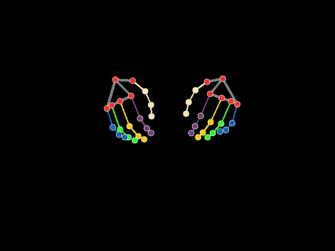

# magic-type
A machine learning tool that lets you type with just a camera.

## Overview

Magic-Type aims to create a virtual keyboard experience using computer vision and machine learning. By tracking hand movements and associating them with specific key presses, this project trains a neural network to predict typed characters based on hand landmark data.

The project consists of two main components:
1.  **Data Collection (`label.py`):** Captures hand landmark data from a webcam feed using MediaPipe and associates it with keys pressed by the user. This data is saved to `hand_gesture_data.json`.
2.  **Model Training (`magic_type_model.py`):** Loads the collected dataset, preprocesses it, and trains a Multi-Layer Perceptron (MLP) neural network to classify hand gestures into corresponding keyboard characters.

## How It Works

1.  **Hand Tracking:** The `label.py` script uses OpenCV to access the webcam and MediaPipe's Hands solution to detect and track 21 3D landmarks for each hand in real-time.


2.  **Data Labeling:** As the user performs hand gestures and presses corresponding keys on their physical keyboard, the script records the 3D coordinates (x, y, z) of both left and right hand landmarks. It also notes which key was pressed (if any) during that frame. The data is structured with an ID, the pressed key, and the landmark points for both hands.

    
3.  **Dataset Generation:** The collected data is stored in `hand_gesture_data.json`. Each entry represents a single frame and contains:
    *   `id`: A unique identifier for the frame.
    *   `key`: The character pressed during that frame (or `null` if no allowed key was pressed).
    *   `left_points`: A list of 21 landmarks for the left hand, each with \[x, y, z] coordinates (or `null` if the hand wasn't detected).
    *   `right_points`: Similar data for the right hand.
4.  **Model Training:**
    *   The `magic_type_model.py` script loads this JSON data.
    *   It preprocesses the features by flattening the 21x3 coordinates for each hand into a 63-feature vector. If a hand is not detected, its features are represented by zeros. The features from both hands are concatenated, resulting in a 126-feature vector per frame.
    *   Input features are scaled using `StandardScaler`.
    *   Character labels (and a "NO_KEY" class for frames without a key press) are numerically encoded and then one-hot encoded.
    *   A Multi-Layer Perceptron (MLP) model is built using TensorFlow/Keras.
    *   The model is trained on the preprocessed data and evaluated for accuracy.

## Setup and Installation

1.  **Prerequisites:**
    *   Python 3.x
    *   A webcam

2.  **Clone the repository (if applicable):**
    ```bash
    git clone <your-repository-url>
    cd magic-type
    ```

3.  **Install required Python libraries:**
    ```bash
    pip install opencv-python mediapipe numpy scikit-learn tensorflow matplotlib
    ```